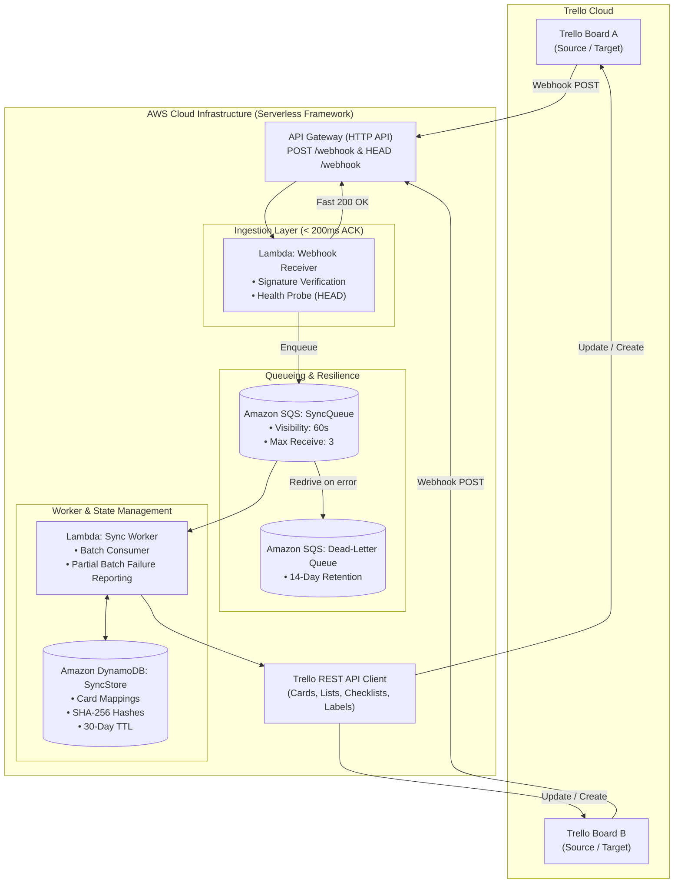

# AWS Serverless Trello Board Sync

[](https://github.com/jamiejustcodes/trello-board-sync-aws)
[](https://nodejs.org)
[](https://www.serverless.com)
[](https://aws.amazon.com)
[](https://opensource.org/licenses/MIT)

An enterprise-grade, event-driven bidirectional synchronization engine built on **AWS Serverless**, designed to link cards across different **Trello** boards in real time.

Built with **TypeScript**, **AWS Lambda**, **Amazon SQS**, **Amazon DynamoDB**, and the **Serverless Framework**, this system tackles real-world cloud engineering challenges including webhook throttling, distributed state synchronization, timing-attack-safe HMAC signature verification, and infinite echo loop mitigation.

---

## 📐 System Architecture



---

## ✨ Key Architectural Highlights

### 1. Fast-ACK & Decoupled Processing (Fan-Out Pattern)
* **The Challenge**: Trello enforces strict response timeouts on webhooks. Heavy downstream processing (fetching card details, diffing checklists, writing to destination boards) can cause webhook delivery timeouts and automatic deactivation.
* **The Solution**: The `webhookReceiver` Lambda performs only essential HMAC signature checks, enqueues the raw payload to **Amazon SQS**, and returns `200 OK` within `< 200ms`. The `syncWorker` Lambda consumes messages asynchronously with automatic retries and a Dead Letter Queue (DLQ).

### 2. Multi-Layered Infinite Loop Prevention
* **Layer 1 (Bot Member Filtering)**: Discards actions initiated by the integration's own bot token (`action.idMemberCreator === botMemberId`).
* **Layer 2 (Deterministic SHA-256 Checksumming)**: Computes a cryptographic hash of synchronized fields (`name`, `desc`, `due`, `dueComplete`, `closed`, `labels`). If an incoming update produces the same hash as the last synced state in DynamoDB, the execution stops early without making redundant API calls.
* **Layer 3 (Bidirectional DynamoDB State Store)**: Maintains indexed card associations (`CARD#<cardA> <-> CARD#<cardB>`) so edits on either board propagate seamlessly to the other without ping-pong effect.

### 3. Production Security & Resilience
* **HMAC-SHA1 Signature Verification**: Validates incoming request signatures against `TRELLO_WEBHOOK_SECRET` using `crypto.timingSafeEqual` to prevent timing-based side-channel attacks.
* **Trello Verification Probe**: Automatically responds to Trello's HTTP `HEAD` challenge during webhook registration.
* **Partial Batch Failures**: Uses SQS batch item failure reporting (`SQSBatchResponse`) so only failing messages are retried rather than reprocessing entire batches.

---

## 📁 Repository Structure

```
├── .github/                  # CI workflows
├── postman/                  # Postman test collection with auto-HMAC signing
│   └── Trello_Sync_API.postman_collection.json
├── scripts/                  # Developer CLI tools
│   └── manage-webhooks.ts    # Webhook setup, listing, and teardown
├── src/
│   ├── config/
│   │   └── env.ts            # Typed environment variable loader & validation
│   ├── handlers/
│   │   ├── webhookReceiver.ts # API Gateway webhook ingest handler (Fast ACK)
│   │   └── syncWorker.ts     # SQS consumer & sync executor
│   ├── services/
│   │   ├── dynamoDbService.ts # DynamoDB mapping & hash management
│   │   ├── sqsService.ts     # SQS client & event publisher
│   │   ├── syncEngine.ts     # Core sync business logic & loop guards
│   │   └── trelloClient.ts   # Trello REST API wrapper
│   ├── types/
│   │   └── trello.ts         # TypeScript interfaces & payload models
│   └── utils/
│       └── signature.ts      # HMAC verification & SHA-256 card hashing
├── tests/                    # Vitest unit test suite
│   ├── signature.test.ts
│   └── syncEngine.test.ts
├── serverless.yml            # Infrastructure as Code (IaC) configuration
├── tsconfig.json             # TypeScript compiler settings
└── package.json
```

---

## 🚀 Quick Start & Deployment

### 1. Prerequisites
* [Node.js](https://nodejs.org) (v20+ recommended)
* [AWS CLI](https://aws.amazon.com/cli/) configured with valid IAM credentials (`aws configure`)
* A [Trello Account](https://trello.com) with API Key & Token generated from [Trello App Keys](https://trello.com/app-key)

### 2. Installation
```bash
git clone https://github.com/jamiejustcodes/trello-board-sync-aws.git
cd trello-board-sync-aws
npm install
```

### 3. Environment Configuration
Copy the example environment file and configure your credentials:
```bash
cp .env.example .env
```

```ini
TRELLO_API_KEY=your_trello_api_key
TRELLO_TOKEN=your_trello_token
TRELLO_WEBHOOK_SECRET=your_custom_webhook_secret

SOURCE_BOARD_ID=64f_source_board_id
TARGET_BOARD_ID=64f_target_board_id
```

To discover your `BOT_MEMBER_ID`:
```bash
npm run manage:webhooks me
```

---

## ☁️ Deployment to AWS

Deploy the complete infrastructure (API Gateway, SQS Queues, DynamoDB Table, and Lambdas) using Serverless Framework:

```bash
# Deploy to dev stage
npm run deploy:dev

# Deploy to prod stage
npm run deploy:prod
```

Upon completion, Serverless will output your API Gateway HTTP URL:
```
endpoints:
  POST - https://xxxxxx.execute-api.us-east-1.amazonaws.com/webhook
  HEAD - https://xxxxxx.execute-api.us-east-1.amazonaws.com/webhook
```

### 4. Register Trello Webhooks
Use the included CLI tool to register webhooks for your source and target boards pointing to your deployed API Gateway endpoint:

```bash
# Register webhook for Source Board
npx tsx scripts/manage-webhooks.ts create <SOURCE_BOARD_ID> https://xxxxxx.execute-api.us-east-1.amazonaws.com/webhook "Sync Source Board"

# Register webhook for Target Board (for bidirectional sync)
npx tsx scripts/manage-webhooks.ts create <TARGET_BOARD_ID> https://xxxxxx.execute-api.us-east-1.amazonaws.com/webhook "Sync Target Board"
```

---

## 🧪 Testing

### Unit Tests
The project includes comprehensive test coverage for HMAC signature validation, content hash generation, loop prevention rules, card creation, and deletion handling:

```bash
# Run unit tests
npm test

# Run tests with coverage
npm run test:coverage
```

### API & Webhook Testing (Postman)
Import `postman/Trello_Sync_API.postman_collection.json` into Postman to test:
1. `HEAD /webhook` health probes.
2. Card creation & update webhook payloads with automated HMAC-SHA1 signature calculation.
3. Loop prevention verification.

---

## 📄 License
This project is licensed under the [MIT License](LICENSE).
